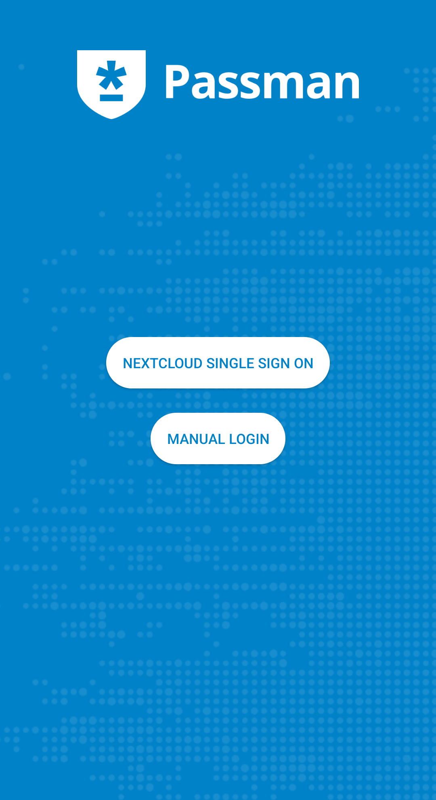
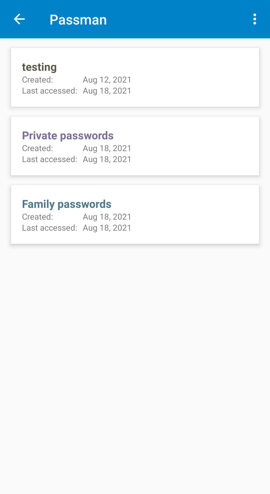
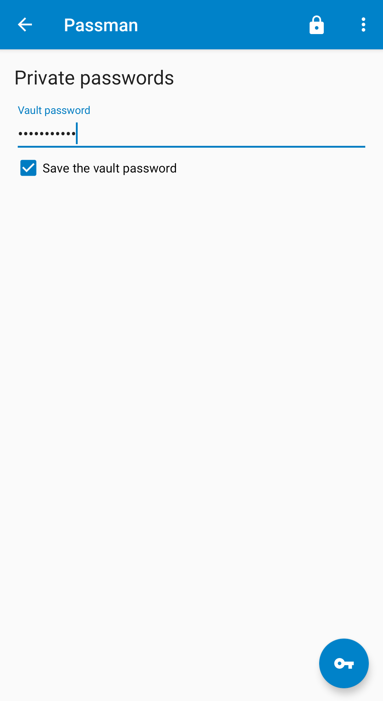

# Passman Android

[](https://github.com/nextcloud/passman-android/releases)

[](https://play.google.com/store/apps/details?id=es.wolfi.app.passman.alpha)
[](https://f-droid.org/app/es.wolfi.app.passman)
[](https://apt.izzysoft.de/fdroid/index/apk/es.wolfi.app.passman)

**Passman for Android** is the official mobile companion for the [Passman](https://github.com/nextcloud/passman) Nextcloud extension. It provides a secure, self-hosted alternative to proprietary password managers, keeping your credentials synchronized across your devices without compromising your privacy.

> [!NOTE]
> This app requires a running Nextcloud instance with the Passman extension installed.

## Screenshots

<p align="center">
  
  
  
</p>

## Features

### Vault Management
- View, add, rename, and delete vaults
- Secure vault login with encrypted stored passwords
- Support for multiple vaults with easy switching
- Option to close the vault after a period of not being used

### Credential Handling
- Full CRUD operations: View, add, edit, and delete credentials
- OTP (One-Time Password) generation for 2FA
- Integrated password generator
- Support for adding, downloading, and deleting file attachments

### Security & Integration
- Modern Android user authentication (Biometrics/PIN/Pattern) for app start
- Android Autofill implementation (requires Android 8+)
- Encrypted offline cache for reliable access without a network connection
- Secure storage using the Android Keystore system
- Optional screenshot protection

## FAQ
For troubleshooting and detailed guides, please read our [Frequently Asked Questions](FAQ.md).

## Demo System
You can test the Passman ecosystem using our [demo system](https://demo.passman.cc/).

## Development

### Prerequisites
- CMake, GCC, and Git
- Android Studio with SDK and NDK installed

### Build steps
1. **Clone & Initialize**:
   ```bash
   git clone https://github.com/nextcloud/passman-android.git
   cd passman-android
   git submodule update --init --recursive
   ```
2. **Signing (for Release/Alpha builds)**:
   - Create a keystore: `keytool -genkey -v -keystore keystore.jks -alias alpha -keyalg rsa`.
   - Configure `gradle.properties` based on `gradle.properties.example`.
   - Fill in the appropriate values for your keystore. If you only build debug builds you can leave the default values.
3. **Android Studio**: If not already done, open the project in Android Studio and install the SDK an the NDK
4. **OpenSSL Configuration**:
   - Copy `openssl.conf.example` to `openssl.conf`.
   - Update `ANDROID_NDK_HOME` and `HOST_TAG` in `openssl.conf` to match your environment.
   - Run `./build-openssl.sh`.
5. **Build**: Build via Android Studio or run `./gradlew assembleDebug`.

### Build in docker using fastlane

If you want to build your own `apk` release, you can use this method instead of using Android Studio to have always a fresh and clean build environment.
It will give you builds for all supported architectures.

0. Preparation (once per machine): Clone this repository, go into the directory, initialize the submodules and run the commands below step by step.
   ```bash
   git clone https://github.com/nextcloud/passman-android.git
   cd passman-android
   git submodule update --init --recursive
   ```
1. Start the container and attach to it. The image like `fabernovel/android:api-35-v1.11.0` needs to match the currently used Android SDK version (see `app/build.gradle` for the `compileSdk`).
   ```bash
   docker run --name passman-android-test -it -v $(pwd):/app -w /app fabernovel/android:api-35-v1.11.0 bash
   ```
   - Run all following commands in the container
2. Install dependencies
   ```bash
   bundle check || bundle install --jobs $(nproc)
   apt update -y && apt install -y curl gcc cmake make

   # this downloads like gradle and the ndk, the later build step requires to be present
   bundle exec fastlane prepare

   # in case this fails, cleanup manually and try the prepare command again
   # rm -rf app/.cxx app/build .gradle .bundle
   ```
3. Build OpenSSL for the supported architectures (give it some time)
   ```bash
   ./build-openssl.sh > build-openssl.log
   ```
4. Run tests
   ```bash
   bundle exec fastlane test
   ```
5. Create a keystore and the `gradle.properties` file. Take a look at the instructions above.
   - Modify `gradle.properties` to and set like this: `RELEASE_STORE=../keystore.jks`. Its important to use a relative path pointing to the parent directory, otherwise the build will fail.
   - The keystore should be created with the alias `release`.
6. Build the app release
   ```bash
   bundle exec fastlane build
   ```
   - you can find the apks in `app/build/outputs/apk/release/`
7. Optional: Exit the container, stop and remove it
   ```bash
   # exit withint the container
   exit

   # stop and remove the container
   docker stop passman-android-test
   docker rm passman-android-test
   ```

## Support Passman
Passman is open source and thrives on community contributions. Whether it's [pull requests](https://github.com/nextcloud/passman-android/pulls) or feedback, all help is welcome!

Please consider donating (we'll gladly accept a _pizza_):
* [Patreon](https://www.patreon.com/passman)
* [Ko-Fi](https://ko-fi.com/passman)
